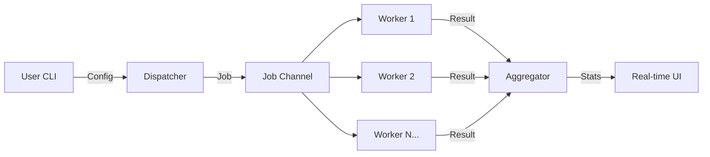

# GoBlast

**GoBlast** is a high-performance, command-line HTTP load testing tool designed to stress-test APIs and web services.

Unlike thread-based load testers that consume heavy system resources, GoBlast leverages Go's **Goroutines** and **Channels** to spawn thousands of concurrent workers with minimal memory overhead, providing real-time latency analysis via a terminal UI (TUI).

## Architecture & Concepts

GoBlast is built around the **Worker Pool pattern** to handle concurrency efficiently without exhausting file descriptors or memory.

# Core Components

- **The Dispatcher:** Generates traffic targets based on the desired Rate (RPS).

- **Worker Pool:** A fixed set of lightweight Goroutines that execute HTTP requests.

- **The Aggregator:** Collects metrics (Status Codes, Latency) via thread-safe channels to avoid race conditions.

- **TUI (Terminal UI):** Renders live histograms and success/error rates using Bubble Tea.
